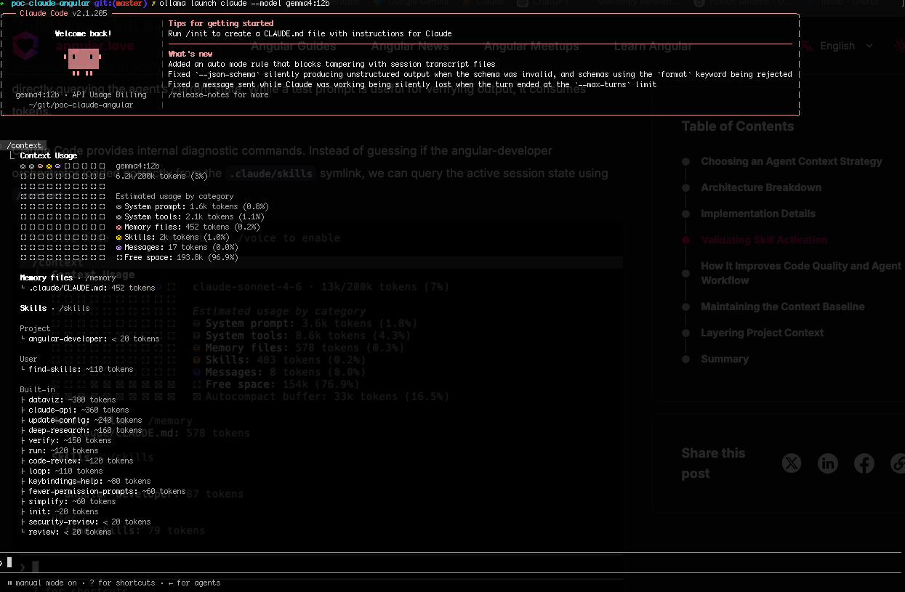
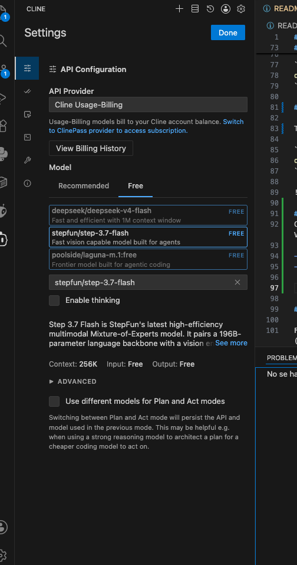

# PocClaudeAngular

This project was generated using [Angular CLI](https://github.com/angular/angular-cli) version 20.3.1.

## Development server

To start a local development server, run:

```bash
ng serve
```

Once the server is running, open your browser and navigate to `http://localhost:4200/`. The application will automatically reload whenever you modify any of the source files.

## Code scaffolding

Angular CLI includes powerful code scaffolding tools. To generate a new component, run:

```bash
ng generate component component-name
```

For a complete list of available schematics (such as `components`, `directives`, or `pipes`), run:

```bash
ng generate --help
```

## Building

To build the project run:

```bash
ng build
```

This will compile your project and store the build artifacts in the `dist/` directory. By default, the production build optimizes your application for performance and speed.

## Running unit tests

To execute unit tests with the [Karma](https://karma-runner.github.io) test runner, use the following command:

```bash
ng test
```

## Running end-to-end tests

For end-to-end (e2e) testing, run:

```bash
ng e2e
```

Angular CLI does not come with an end-to-end testing framework by default. You can choose one that suits your needs.

## Generate context for claude

If after schaffold your project the CLAUDE.md memory file is not created. Execute this command:

```bash
ng generate ai-config --tool=claude
```

## Install angular-developer skills

Install the last angular team skill to code angular projects

```bash
npx skills add angular/skills/angular-developer
```

## Install reasoning model

Pull the model gemma4:12b

```bash
ollama pull gemma4:12b
```

## Install Claude Code CLI

To use your local LLM models start claude code from ollama using launch command. You must first pull the model to be used with Claude Code:

```bash
ollama launch claude --model gemma4:12b
```



## Install Cline in VC
Claude Code is a grate tool. But using the UI CLI. If you want to have a better experience creating your code you can install cline in your VC environment.

- Install cline like other extension in VC.
- First you must register an account in cline to configure the extension. the extension.
- Configure the model to be used by cline from API Configuration. You can use ollama or external models (someones are free) as API Provider.



## Additional Resources

For more information on using the Angular CLI, including detailed command references, visit the [Angular CLI Overview and Command Reference](https://angular.dev/tools/cli) page.
